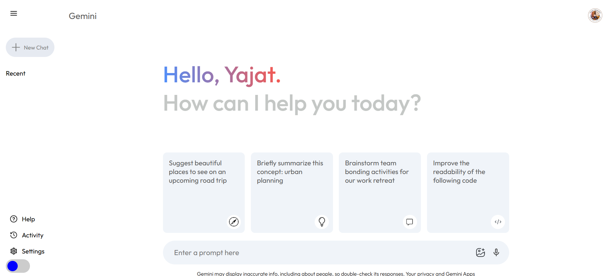

# React + Vite  

This template provides a minimal setup to get React working in Vite with HMR and some ESLint rules.  

Currently, two official plugins are available:  

- [@vitejs/plugin-react](https://github.com/vitejs/vite-plugin-react/blob/main/packages/plugin-react/README.md) uses [Babel](https://babeljs.io/) for Fast Refresh  
- [@vitejs/plugin-react-swc](https://github.com/vitejs/vite-plugin-react-swc) uses [SWC](https://swc.rs/) for Fast Refresh  

---

# Gemini App  


Gemini App is an interactive AI chat application inspired by ChatGPT. It allows users to engage in natural language conversations with an AI model.  

## Features  

- **Natural Language Processing**: Engage in conversations with Gemini using natural language.  
- **Multiple Topics**: Discuss a wide range of topics from general knowledge to specific queries.  
- **User-Friendly Interface**: Simple and intuitive interface for seamless interaction.  
- **Responsive Design**: Access Gemini from various devices with responsive design support.  

---

## Screenshot  

Here’s a screenshot of the website:  

  

---

## Live Website  

Check out the live version of the **Gemini Clone** website:  

[](https://yajatgeminiclone.netlify.app/)  

---

## Technologies Used  

- **React**: Frontend UI library for building interactive interfaces.  
- **Gemini Free API**: Used to power AI responses without cost barriers.  
- **Node.js / Express**: Backend server for handling API requests and interactions.  
- **Socket.io**: Real-time communication between client and server.  
- **Vite**: Lightning-fast development server and build tool.  

---

## API Configuration (Gemini Free API)  

To set up the **Gemini Free API**, follow these steps:

1. Create a `.env` file in the root directory of your project.  
2. Add your **Gemini Free API key**:

   ```env
   VITE_GEMINI_API_KEY=your_api_key_here
   ```

3. Update your API call in your project:

   ```javascript
   const apiKey = import.meta.env.VITE_GEMINI_API_KEY;

   async function fetchGeminiResponse(prompt) {
       const response = await fetch('https://api.gemini.com/v1/chat', {
           method: 'POST',
           headers: {
               'Content-Type': 'application/json',
               'Authorization': `Bearer ${apiKey}`
           },
           body: JSON.stringify({ prompt })
       });
       const data = await response.json();
       return data;
   }
   ```

4. Restart your development server:

   ```bash
   npm run dev
   ```

---

## Installation  

To run the **Gemini App** locally, follow these steps:

1. Clone the repository:

   ```bash
   git clone https://github.com/yajatwasisht/gemini-app.git
   cd gemini-app
   ```

2. Install dependencies:

   ```bash
   npm install
   ```

3. Start the development server:

   ```bash
   npm run dev
   ```

4. Open your browser and visit `http://localhost:3000/`.  

---

## Contribution  

Contributions are always welcome! Feel free to fork the repository and submit a pull request.  

---

## License  

This project is licensed under the **MIT License**.  

---
